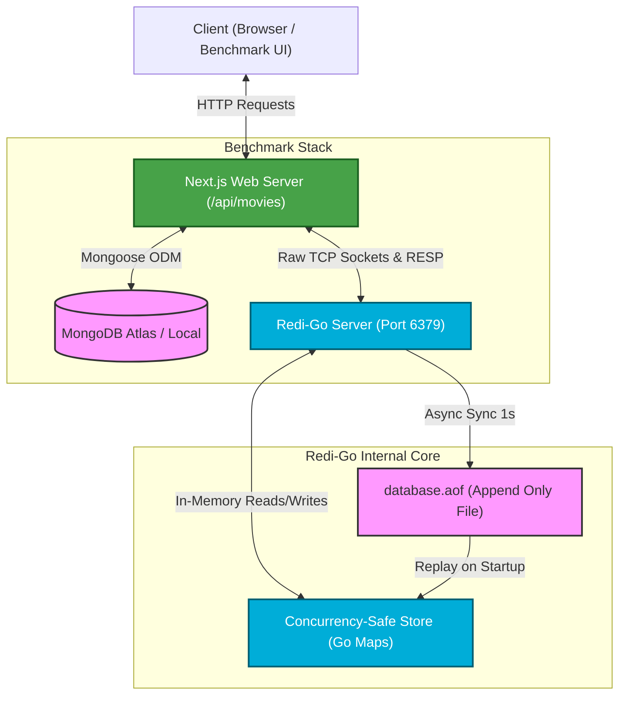
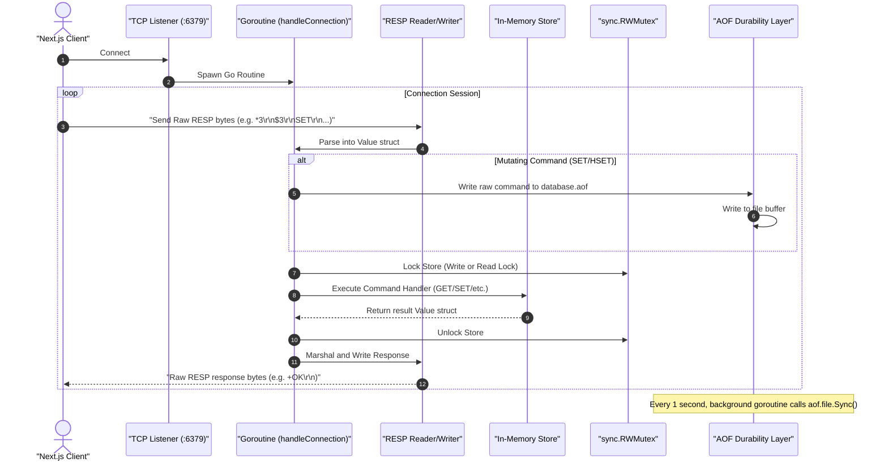

# 🚀 Redi-Go

> A concurrent, Redis-compatible in-memory key-value database and cache built from scratch in Go, paired with a Next.js performance benchmarking application.

[](https://golang.org)
[](https://nextjs.org)
[](https://mongodb.com)
[](https://typescriptlang.org)
[](https://en.wikipedia.org/wiki/Transmission_Control_Protocol)
[](https://redis.io/docs/reference/protocol-spec/)

---

## 📋 Table of Contents

- [🚀 Redi-Go](#-redi-go)
  - [📋 Table of Contents](#-table-of-contents)
  - [💡 Design Rationale: Why Go Over C?](#-design-rationale-why-go-over-c)
  - [🏗️ System Architecture](#️-system-architecture)
    - [High-Level Architecture](#high-level-architecture)
    - [Low-Level Request Lifecycle](#low-level-request-lifecycle)
  - [⚡ Performance Demonstration (Video)](#-performance-demonstration-video)
  - [⚙️ Technical Deep Dive](#️-technical-deep-dive)
    - [1. RESP Protocol Parser \& Serializer](#1-resp-protocol-parser--serializer)
    - [2. Concurrency Control](#2-concurrency-control)
    - [3. Durability (AOF Persistence)](#3-durability-aof-persistence)
    - [4. TTL \& Expiration (Lazy Deletion)](#4-ttl--expiration-lazy-deletion)
  - [🔌 Next.js Custom RESP Client](#-nextjs-custom-resp-client)
  - [🎯 Supported Commands](#-supported-commands)
  - [🛠️ Directory Structure](#️-directory-structure)
  - [🚀 Getting Started \& Local Setup](#-getting-started--local-setup)
    - [Prerequisites](#prerequisites)
    - [1. Run the Redi-Go Server](#1-run-the-redi-go-server)
    - [2. Run the Next.js Benchmark Client](#2-run-the-nextjs-benchmark-client)
  - [👨‍💻 Team \& Supervision](#-team--supervision)
  - [📜 License](#-license)

---

## 💡 Design Rationale: Why Go Over C?

Traditional Redis is written in C and operates as a single-threaded event loop. For this educational clone, **Go** was selected as the systems language over C/C++ due to specific architectural and software engineering advantages:

| Feature / Criteria | Go (Golang) | C / C++ |
| :--- | :--- | :--- |
| **Concurrency Model** | Built-in Goroutines (M:N user-space threads) + Channels. Extremely lightweight (`~2KB` overhead). | Manual POSIX Threads (1:1 kernel threads) or raw epoll/kqueue event loop. High complexity and overhead. |
| **Memory Management** | Automatic garbage collection. Eliminates manual pointer management errors. | Manual `malloc` / `free`. Highly susceptible to memory leaks, dangling pointers, and buffer overflows. |
| **Standard Library** | Comprehensive network abstractions (`net`), buffered I/O (`bufio`), and sync primitives (`sync`). | Minimal standard library. Socket handling requires complex, platform-specific system calls (or large dependencies). |
| **Safety & Vulnerabilities** | Memory-safe by default. Strongly typed. | Unsafe pointer arithmetic. Vulnerable to remote code execution (RCE) via memory exploits. |
| **Compilation & Build** | Compiles instantly to a single, static cross-platform binary with zero dynamic library dependencies. | Complex compilation flags, makefiles, linker scripts, and cross-platform build challenges. |

- **Memory Safety & Reliability**: Network services in C are notorious for pointer bugs and memory leaks. Go provides compile-time safety and automatic runtime garbage collection, removing the risk of memory corruption without sacrificing low-level network performance.
- **Lightweight Concurrency**: To support concurrent command execution, C requires heavy OS-level kernel threads (`pthreads`) which consume ~8MB of virtual memory stack space each. Go uses **Goroutines** (user-space cooperative threads) starting at only ~2KB, allowing Redi-Go to scale to thousands of concurrent client connections with negligible system overhead.
- **Robust Cross-Platform Networking**: Go's standard library wraps high-performance OS-level event notification mechanisms (like `epoll` on Linux, `kqueue` on macOS, and `IOCP` on Windows) inside simple, unified TCP connection blocks (`net.Conn`). In C, writing cross-platform asynchronous networks requires complex event loops.
- **Developer Velocity**: Go compiles in milliseconds to a single static binary. It lacks header files, makefiles, or library dependencies, which speeds up code iteration.

---

## 🏗️ System Architecture

### High-Level Architecture

The system consists of a Next.js web application executing parallel performance benchmarks. It compares query durations when pulling movies directly from MongoDB against fetching cached JSON strings from Redi-Go:



---

### Low-Level Request Lifecycle

When a client transmits a command, Redi-Go processes the socket connections concurrently via lightweight goroutines, synchronizes access to the data layers using read/write mutex locks, and appends mutations to the Append-Only File (AOF):



---

## ⚡ Performance Demonstration (Video)

To show the efficiency of in-memory caching, the benchmark compares direct database queries against cached lookups using Redi-Go.

### Latency Summary
- **Direct MongoDB Query**: **~200–300 ms** response latency (requires round-trips, indexes, query parsing, and disk read operations).
- **Redi-Go Cache Hit**: **~1–3 ms** response latency (served directly from concurrent-safe RAM maps).

https://github.com/user-attachments/assets/demo-placeholder

<div align="center">
  <video src="./Demo.mkv" controls width="100%" style="border-radius: 8px; border: 1px solid #444; box-shadow: 0 4px 12px rgba(0,0,0,0.15);">
    Your browser does not support the video tag. You can view the demo video here: <a href="./Demo.mkv">Demo.mkv</a>
  </video>
</div>

---

## ⚙️ Technical Deep Dive

### 1. RESP Protocol Parser & Serializer
Redis client/server communication is powered by the **RESP (REdis Serialization Protocol)**. Redi-Go includes a native custom parser and serializer (`cmd/resp.go`) utilizing `bufio.Reader` and `io.ReadFull` to read type headers and parse input into a standard data structure:

```go
type Value struct {
    typ     string   // "array", "bulk", "string", "null", "integer", "error"
    str     string   // Used for simple strings and errors
    bulk    string   // Used for bulk strings
    integer int      // Used for integers
    array   []Value  // Nested values for arrays
}
```

RESP payloads are identified by their first byte:
* Array: `*<number of elements>\r\n`
* Bulk String: `$<length>\r\n<data>\r\n`
* Simple String: `+<data>\r\n`
* Integer: `:<integer>\r\n`
* Null: `$-1\r\n`

---

### 2. Concurrency Control
Since client connections are processed concurrently inside unique goroutines (`cmd/main.go`), memory safety is preserved using **`sync.RWMutex`** locks (`cmd/handler.go`). This provides maximum read throughput while avoiding data races during modifications:
* **Read-heavy operations** (`GET`, `HGET`, `HGETALL`, `EXISTS`, `TTL`) obtain a Shared Read Lock (`RLock()`), enabling multiple goroutines to read simultaneously.
* **Mutating operations** (`SET`, `HSET`, `DEL`, `EXPIRE`, `INCR`, `HDEL`) obtain an Exclusive Write Lock (`Lock()`), serializing updates safely.

---

### 3. Durability (AOF Persistence)
Redi-Go implements **Append-Only File (AOF)** logging for state durability (`cmd/aof.go`):
1. **Append**: Every mutating operation (`SET`, `HSET`) is logged sequentially in RESP format to `database.aof` at the time of modification.
2. **Background Sync**: A background syncing goroutine wakes up every second (`time.Sleep(time.Second)`) and invokes `file.Sync()`, flushing kernel buffers to the disk. This mirrors Redis's `appendfsync everysec` configuration, balancing writing performance with durability.
3. **Replay**: At startup, `main.go` reads `database.aof` sequentially using the RESP reader, piping commands directly into handlers to rebuild the in-memory state.

---

### 4. TTL & Expiration (Lazy Deletion)
Keys with associated TTLs (Time to Live) are stored in an expiration table (`TTLs = map[string]time.Time`). To keep operations fast, Redi-Go uses **Lazy Deletion**:
* When a lookup (`GET`) occurs, the key is checked against the expiry table.
* If `time.Now().After(expireAt)` evaluates to `true`, Redi-Go deletes the key and returns a `null` response. This avoids run-loop overhead from aggressive active cleanup tasks.

---

## 🔌 Next.js Custom RESP Client

To bypass heavy external dependencies, the Next.js benchmark uses a custom TypeScript client (`app/src/lib/redis.ts`) communicating directly via raw TCP sockets (`net.Socket`). The client formats commands into RESP strings and parses the returned stream sequentially:

```typescript
// Custom RESP command serialization
async get(key: string): Promise<string | null> {
  const k = Buffer.byteLength(key);
  const cmd = `*2\r\n$3\r\nGET\r\n$${k}\r\n${key}\r\n`;
  const resp = await this.send(cmd);
  return resp;
}
```

The client buffers TCP streams, identifies headers, reconstructs chunked responses, and resolves/rejects pending execution promises in order.

---

## 🎯 Supported Commands

Redi-Go implements the following core commands:

* **Strings**: `GET`, `SET`, `DEL`, `EXISTS`, `INCR`
* **Hashes**: `HSET`, `HGET`, `HGETALL`, `HDEL`
* **Key Control**: `EXPIRE`, `TTL`
* **System**: `PING`

---

## 🛠️ Directory Structure

```
.
├── cmd/
│   ├── main.go      # Server entry point, TCP loop, AOF replay
│   ├── resp.go      # RESP protocol deserializer & serializer
│   ├── aof.go       # Durability logging, background syncing
│   ├── handler.go   # Mutex-locked commands (GET/SET/HSET/TTL/etc.)
│   ├── go.mod       # Module declaration
│   └── database.aof # Persisted commands database log
├── app/
│   ├── src/
│   │   ├── app/     # Next.js page routing & benchmark API endpoints
│   │   ├── lib/     # Custom RESP client & MongoDB connections
│   │   ├── models/  # MongoDB Mongoose schemas
│   │   └── stores/  # State management for benchmarks
│   ├── package.json
│   └── .env.local   # App config env values
├── Demo.mkv         # High-resolution cache performance demo video
└── README.md        # Documentation
```

---

## 🚀 Getting Started & Local Setup

### Prerequisites
* **Go**: Version 1.20+
* **Node.js**: Version 18+ (for Next.js benchmark)
* **MongoDB**: A running local instance or a MongoDB Atlas connection string.

### 1. Run the Redi-Go Server

Navigate to the `cmd` directory and run the Go compiler:

```bash
cd cmd
go run main.go
```

The server starts listening on TCP port `6379` (standard Redis port). You can test connectivity using standard `redis-cli`:

```bash
redis-cli -p 6379
127.0.0.1:6379> PING
PONG
127.0.0.1:6379> SET name redigo
OK
127.0.0.1:6379> GET name
"redigo"
```

---

### 2. Run the Next.js Benchmark Client

1. Navigate to the `app` directory:
   ```bash
   cd app
   ```
2. Install the frontend dependencies:
   ```bash
   npm install
   ```
3. Set your MongoDB connection string in `.env.local`:
   ```env
   MONGODB_URI=your_mongodb_connection_uri_here
   ```
4. Run the development server:
   ```bash
   npm run dev
   ```
5. Open your browser to `http://localhost:3000` to view the caching benchmarking tool.

---

## 👨‍💻 Team & Supervision

* **Bhikrant Borah**
* **Shaswata Gogoi**
* **Syed Tasdeeque Ruhani**

Under the supervision and guidance of **Mr. Diganta Baishya**, Associate Professor, CSE Department.

---

## 📜 License

This project is created for **academic and educational purposes**. Feel free to use, modify, and extend the codebase for learning.
